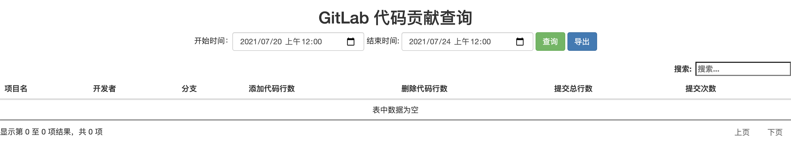

# GitLab Statistics



## Installation
```bash
pip install -r requirements.txt
```

## Usage
1. Create a personal access token in your GitLab.
2. Configure your GitLab URL and private token in `server.py`:
    ```py
    gitlab_cli = gitlab.Gitlab("http://gitlab.com",
                               private_token="******",
                               timeout=50,
                               api_version="4")
    ```
3. (optional) Customize your favorite page in `templates/gitlab.html`.
4. Run server:
    ```bash
    python server.py
    ```

## Contribution
This project is a updated version of [gitlab](https://github.com/xiaoyaolaotou/gitlab).
